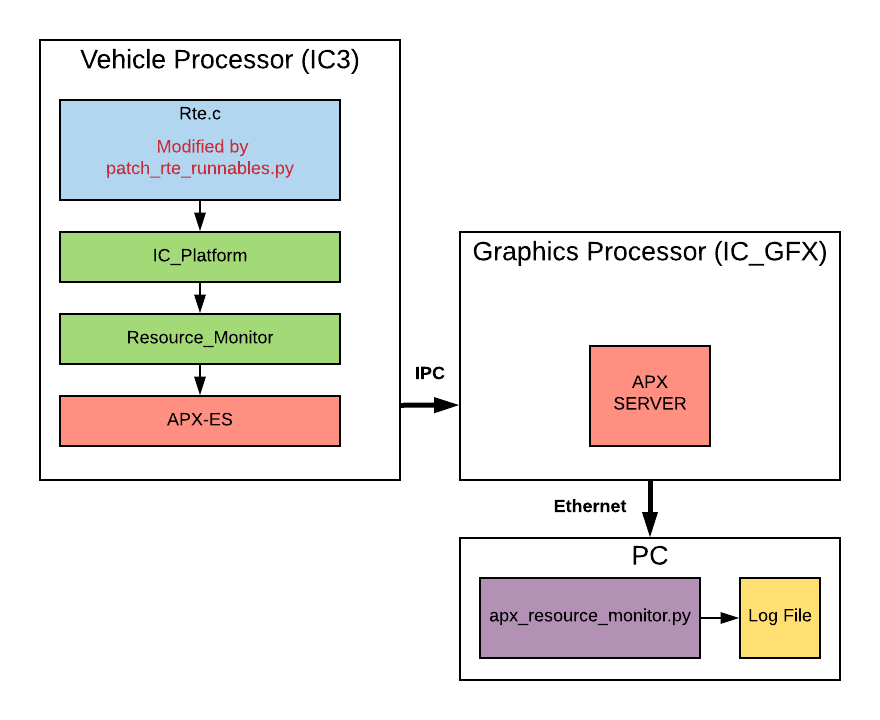

# Measuring Execution Times of RTE Runnables

## Overview

With the platform built for the VOLVO IC, we can trace our RTE runnables using a software solution.
This does not require special tracing hardware. However, the measurements will impact general performance of the system.

**What can be traced:**

- When is a runnable called? (Milliseconds since start of OS system timer).
- For how long is the runnable executing? (Microseconds based on high resolution HW timer).

Tracing many runnables requires a high bandwith data bus. In the IC platform we use IPC channel 13 to stream this data from VP to GFX.
Once data has reached GFX we can redirect it over Ethernet to a logging PC.
In current configuration, this can be done for a single runnable or up to 150 runnables simultaneously.
Note that this uses a lot of bandwith from the IPC bus (approx. 0.35MBit/s or 18% of SPI bus capacity when tracing 150 runnables).



## Error Handling

In the situation where too many data points is collected before it has time to transmit previous data set over IPC bus the MSW will activate an infinte
loop which eventually triggers a watchdog reset. Should this happen you need to reduce the number of simultanous measurements
(reduce the max number of runnables or use a runnable ignore-list).

If the IPC bandwith is excedded it will trigger an internal buffer overflow error on APX level. The consequence of this is that you will get an empty log file.
This situation cannot happen unless you manually change the internal limits of max 150 simultanous measurement to a value larger than 255 measurements.

## About Interrupts

Disabling interrupts is currently not possible since Vector code will automatically re-enable interrupts during an Rte_Write/Rte_Send call done by a runnable.

In the future we might find a way to patch all calls to Rte_Write/Rte_Send in such a way that interrupts are not accidentally enabled while measurement is
active. In the meantime, interrupts are still being serviced as normal during measurements. This means that the elapsed time for a runnable always include
some interrupt routine handling.

Due to this fact we make the following assumptions:

1. Interrupt-servicing is somewhat evenly distributed over time.
2. Interrupt-servicing affects all runnables in equal manner and its impact will reduce when average elapsed time is used for a runnable.

It's therefore important to peform analysis using the average elapsed time instead of the elapsed time of a single call to a runnable.

## About OS Scheduling

Once a measurement period starts (time-stamps have been acquired) the RTOS scheduler is temporarily blocked from pre-empting currentlt running OS task.
Once the runnable measurement is complete the OS scheduler is unblocked and scheduling can take place as normal.
This means that OS task scheduling is only allowed **between** execution of runnables. This behavior differs from normal MSW builds where no measurements
are performed.

## User Guide

### Building the MSW

First we must build the MSW normally. This generates all files in the derived folder that we will later modify.
In addition, we must also activate compilation of resource monitor by giving an extra argument to make.

```bash
make clean
make win_build RMON=1
```

If you want, you can build an MSW that plays sounds silently. Then you use this command instead.

```bash
make win_build RMON=1 SOFT_SOUND_VOLUME=0
```

### Patching the MSW

The script *patch_rte_runnables.py* found in `ic3_shared/scripts` has multiple functions:

1. Takes a backup copy of `derived/dvcfg/Rte.c` => `derived/dvcfg/Rte_Patched_Orig.c` (if not already exists).
2. Creates a new copy of `derived/dvcfg/Rte.c` containing patched function calls to runnables it wants to trace.
3. Generates a new header file `derived/includes/Rte_RunnableMap.h` containing a unique (integer) id for each runnable.
4. Generates a new file `ic3_shared/config/runnable_id_map.json` used later by PC logging program.

See separate chapter at the end of this article for more details on the script and all its different options.

After the script has been run and a new copy of Rte.c has been generated you build the MSW incrementally.

```bash
make win_build RMON=1
```

or

```bash
make win_build RMON=1 SOFT_SOUND_VOLUME=0
```

This recompiles only Rte.c and relinks the MSW. Now you can generate load files and flash the MSW using either Engineering Tool 2.0 or directly using Green Hills Multi with hardware debugger.

```bash
make et_xml
make v3_load_package
```

### Collecting data from the MSW

The patched MSW is now capable of streaming a lot of data on IPC channel 13. It sends info about when a runnable is activated as well as its execution time.

Since GFX takes several seconds to boot, the first few seconds of execution is always lost. Hence, this mechanism is only suitable for measuring periodic runnables. Measuring init runnables for example requires a different approach and will not be covered here (there is another mechanism that can track startup events that can be used for this).

The script `ic3_shared/util/resource_monitor/apx_resource_monitor.py` is the program you will use to collect the tracing data from ethernet.

First, open the file `ic3_shared/util/resource_monitor/config.json` and make sure that this is true:

```json
"monitor_runnables": true
```

It is **strongly recommended** that you set all other boolean options to *false*, otherwise you will risk overflowing IPC channel 13 and end up with a buffer overflow error in VP.

Once you have updated the config file, save and close it.

Start the IC and keep it alive using either Engineering Tool or Canoe. Once GFX has booted up you should first verify that you have valid IP route to the cluster.

```bash
ping 192.168.137.123
```

If this test pass you can now start the monitor script.

```bash
./apx_resource_monitor.py
```

Once started, it will continously log data to the file `ic3_shared/util/resource_monitor/logs/runnable_monitor.csv`.
Run the script for as many seconds as you like, then stop it by pressing ctrl-c on the keyboard (the size of the CSV file remains at 0 bytes while running the script).

### Analyzing the data

Once the monitoring script is stopped, open the file runnable_monitor.csv in Excel (double-click on the file in Explorer or use cygstart in Cygwin).
Once in Excel, activate filters by clicling on "Data->Filter" in the menu ribbons. Next adjust the column widths by double clicking on each column border.

Now you are ready to analyze the data. The columns are (from left to right):

- SysCounter (ms) &#8212; System time when the runnable was called. This will always start in the thousands since you miss the first seconds while GFX boots.
- SysCounterDelta (ms) &#8212; Milliseconds since this runnable was last called. This is used to track how well a runnable keeps it periodicity.
- Elapsed (ms) &#8212; Execution time of the runnable. It's pre-divided by a factor of a thousand, converting it from microseconds to milliseconds.
- AverageElapsed (ms) &#8212; Moving average elapsed time. It takes 10 iterations (of the same runnable) before a value is calculated.
- MaxElapsed (ms) &#8212; Highest seen (peak) elapsed value for that runnable (up until that point in system time).
- VehicleMode &#8212; Raw value of the VehicleMode_Internal signal. This can be useful to measure runnable execution times during mode transitions.

## Script patch_rte_runnables.py

Patch function calls of runnables in Rte.c in such a way that they can be measured and traced later.

**Usage:**

```text
patch_rte_runnables.py [-h] [--target TARGET] [--runnable RUNNABLE]
                       [--task TASK] [--offset OFFSET]
                       [--max-runnable MAX] [--runnable-file FILE]
                       [--ignore-file FILE] [--name NAME]
```

**Arguments:**

```text
-h --help               Displays help message.
--target                Name of ancestor directory to apply the patch (Defaults to R850GHS).
-r --runnable           Name of runnable to patch. String format must be "OsTaskName.RunnableName".
                        This option can be applied multiple times.
--task                  Automatically patches all runnables in this OS task.
                        Combine with --ignore-file to ignore unwanted runnables.
--offset                Used with --task option. Start automatic patching once this many
                        runnables have been encountered in OS task.
-x --max-runnable       Max limit of runnables to patch. The hard limit is 150. Default is 145.
-F --runnable-file      Path to JSON file containing a list of strings of runnables to patch.
                        Good alternative to --runnable option if many runnables needs to be patched.
                        Each string in this file must be of the format "OsTaskName.RunnableName"
-I --ignore-file        Name of JSON file containing list of runnables to ignore during auto-patching.
                        Each string in this file must be of the format "OsTaskName.RunnableName"
```

### Example 1 &#8212; patching a single runnable

We want to measure the timing of runnable Frt_5ms, the very first runnable of *Rte_Task* OS task.

```bash
./patch_rte_runnables.py -r Rte_Task.Frt_5ms
```

### Example 2 &#8212; patching multiple runnables

We want to measure the timing of these runnables:

- Rte_Task.Frt_5ms
- Rte_Task.MainDisplay_run
- Rte_Task.ICGFXProxy_run

**Option 1 &#8212; command line arguments:**

```bash
./patch_rte_runnables.py -r Rte_Task.Frt_5ms -r Rte_Task.MainDisplay_run Rte_Task.ICGFXProxy_run
```

**Option 2 &#8212; configuration file:**

Create a new JSON file called `runnables_to_measure.json`.

```json
[
    "Rte_Task.Frt_5ms",
    "Rte_Task.MainDisplay_run",
    "Rte_Task.ICGFXProxy_run"
]
```

Now call `patch_rte_runnables.py` with the JSON file as input.

```bash
./patch_rte_runnables.py --runnable-file runnables_to_measure.json
```

### Example 3 &#8212; Patch all runnables in Rte_Task

When you patch an entire OS task it's recommended that you use an ignore-file. This file contain names of runnables that will not be measured.
These runnables are typically so short in their execution time (one to a few microseconds) that they are simply not interesting to measure.
To get you started you can use the checked in ignore-file  `ic3_shared/config/runnable_measure_ignore.json`.
It contains names of runnables whose runtime is so small it can essentially be ignored.

```bash
./patch_rte_runnables.py --task Rte_Task --ignore-file ../config/runnable_measure_ignore.json
```

Automatic patching of an RTE task can be combined with --runnable or --runnable-file arguments in case you also want to measure some
runnables on other OS tasks.

```bash
./patch_rte_runnables.py --task Rte_Task --ignore-file ../config/runnable_measure_ignore.json \
--runnable SchM_Task.Com_MainFunction_Rx --runnable SchM_Task.Com_MainFunction_Tx
```

If you want to recreate the log file seen in the DUXI Demo you can use the checked in runnable-file which adds the most expensive runnables
from Vector BSW.

```bash
./patch_rte_runnables.py --task Rte_Task --ignore-file ../config/runnable_measure_ignore.json \
--runnable-file ../config/runnable_measure_force.json
```

### Example 4 &#8212; Manually add custom measure points

If you are analyzing a particular runnable and want to know how long each part of the code takes to execute you can add custom measure points.

First you need to regenerate `ic3_shared/config/runnable_id_map.json` with custom names.
Regenerating this file is important for the monitoring script apx_resource_monitor.py since it reads it in order to create the log file.

This time we will not patch any runnable calls in Rte.c since we want to know what part inside the runnable takes the longest to execute.
We will simply add a few custom names we will use in the code. In this particular example we have two sections of code we want to measure.
We simply call them *Part1* and *Part2*.

```bash
./patch_rte_runnables_py --name Part1 --name Part2
```

This generates a version of `runnable_id_map.json` containing this information:

```json
{
    "Part1": 0,
    "Part2": 1,
    "RESERVED": 255
}
```

Likewise, the script also generates a version of the file `Rte_Runnable_Map.h` with the same information.

```C
#define RTE_PART1_ID 0u
#define RTE_PART2_ID 1u
#define RTE_INVALID_RUNNABLE_ID 255u
```

In the C file of your SWC, begin by including the necessary header files.

```C
#include "osek.h"
#include "Rte_RunnableMap.h"
#include "IC_Platform.h"
```

In the code that you want to measure, declare a new stack variable (in the nearest scope).

```C
ic_platform_ref_time_t referenceTime;
```

Before the code under measurement add the lines:

```C
GetResource(OsResource);
IC_Platform_get_reference_time(&referenceTime);
```

After the code under measurement, add the lines:

```C
IC_Platform_insert_runnable_execution_event(ID, &referenceTime);
ReleaseResource(OsResource);
```

Where *ID* is an ID defined in the header Rte_Runnable_Map.h.

Put together, the code should look something like this:

```C
ic_platform_ref_time_t referenceTime;

//...

GetResource(OsResource);
IC_Platform_get_reference_time(&referenceTime);
//CODE UNDER MEASUREMENT (PART1)
IC_Platform_insert_runnable_execution_event(RTE_PART1_ID, &referenceTime);
ReleaseResource(OsResource);

//...

GetResource(OsResource);
referenceTime = IC_Platform_get_frt_ref();
//CODE UNDER MEASUREMENT (PART2)
IC_Platform_insert_runnable_execution_event(RTE_PART2_ID, referenceTime);
ReleaseResource(OsResource);

```

The code begins by blocking the RTOS scheduler from activating a higher priority task during measurement.
Next, it saves current SystemTime (a.k.a. OS time) and value of free-running timer. Now we know what time it was when measurement started.
After this it's time to run the code under measurement, this can be a function call or an entire code block.

After the code has finished execution we call the special function *IC_Platform_insert_runnable_execution_event*. This function
samples the free-running timer again (time now) and calculates how many microseconds have elapsed.
When this is done we release the OS resource. Higher priority OS tasks are now able to run again if needed.

Every time we call IC_Platform_insert_runnable_execution_event we give it a unique ID to tell the PC logging script apx_resource_monitor.py what part
of the code just executed.

