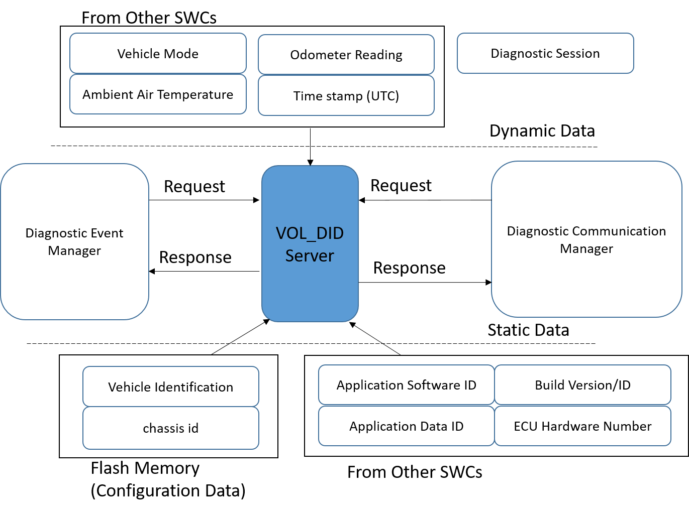

Diagnostic Server for Common Data Identifiers - VOL_DIDServer
========

## Overview
Module provides constant and dynamic diagnostic data to Diagnostic Communication manager when requested by Diagnostic tester.   

Module Initializes the dynamic data to their default values and periodically updates the data received from other SWCs.

## The following Static stored data provided by the Module:

### Application Software Identification and Build Version

| Module ID			| Part Number			| Build Version    | Description	 | 
|:---				|:---:              	| :--:             | ---:        	 | 
|UFBL_MODULE_ID		|BOOTLOADER_PARTNUMBER	|None 			   |Bootloader Software				 |
|MSW_MODULE_ID		|MSW_PARTNUMBER			|BUILD_VERSION_MSW |Application Software				 | 
|CSW_MODULE_ID		|Part number			|None			   |optional module				 | 
		
### Application Data Identification and Buid ID

| Module ID			| Part Number				  | Build Version    | Description	 														 | 
|:---				|:---:              		  | :--:             | ---:        	 														 | 
|APP_MODULE_ID		|DATASET_PARTNUMBER			  |DATASET_BUILD_ID  |Data set - Configuration parameters									 |
|APP_MODULE_ID		|POSTBUILD_PARTNUMBER		  |POSTBUILD_BUILD_ID|Post build data area for Software Configuration						 | 
|APP_MODULE_ID		|SOUND_PARTNUMBER			  |None			     |Data area to handle the Sound on IC									 |
|APP_MODULE_ID		|DWM_CONFIGURATION_PARTNUMBER |None			     |Dynamic Window manager data area to handle the pixel data.Valid for IC.| 

## ECU Hardware Number

| Module ID			| Part Number				  | Serial Number    | Sub Module info	 | 
|:---				|:---:              		  | :--:             | :---:        	 | 		 
|HW_MODULE_ID		|HARDWARE_PARTNUMBER		  |HARDWARE_SERIAL_NO  |SUB_HW_MODULE_ID,Sub node Part number,Sub node serial number |
							